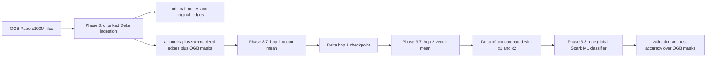

# Papers100M Pipeline Brief

## One-minute explanation

We redesigned the Papers100M path so Spark handles graph-scale data preparation and propagation without collecting the graph or adjacency lists into one Python process. The original community-GNN route was safe only when communities and edges were sampled: a full-edge attempt failed because it grouped large edge lists into Python/Arrow payloads. The new path stores the graph in Delta Lake, runs two distributed mean-aggregation hops over the full Phase 0 graph, caches the resulting features, and trains one global Spark ML classifier. This replaces repeated per-epoch graph message passing with a one-time, distributed, resumable preprocessing pass.

The key research claim is therefore: **EMO can make all ingested Papers100M nodes and symmetrized graph edges available to a distributed CPU graph-learning workflow without driver-side graph collection.** The current final predictor is a global multinomial logistic probe over cached two-hop propagated features, not a full-batch GNN and not a claim of full-neighbor message passing during every training epoch.

## Dataset and experimental protocol

| Item | Current implementation |
|---|---|
| Dataset | OGB `ogbn-papers100M` citation graph |
| Scale | 111,059,956 nodes, 128-dimensional float features, 172 classes |
| Raw topology | The OGB directed edge file is retained in `original_edges` (the ingestion log describes approximately 1.6B directed records). |
| Propagation topology | `edges` is constructed by adding reverse edges, removing self-loops, and de-duplicating `(src, dst)`. Phase 3.7 therefore uses the symmetrized graph. |
| Labels and evaluation | Official OGB time-based train/validation/test masks are used (`USE_OGB_SPLITS = True`). Unlabelled nodes remain in propagation but are excluded from classifier fitting and scoring. |
| Reproducibility | Fixed seed 42; named S3/Delta paths keyed by experiment, dataset, and algorithm; Phase 3.7 hop checkpoints are reusable. |
| Active run configuration | Phase 3.7: Phase 0 source, 2 hops, 512 Spark partitions. Phase 3.8: multinomial logistic regression, 30 maximum iterations, $L_2$ regularization $10^{-4}$. |

## Data flow and new phases

### Phase 0: zero-RAM-oriented ingestion

1. The driver locates or downloads the Papers100M archive on the largest writable EMR volume.
2. Node features and labels are memory-mapped, then written to Delta in 200,000-node chunks. This avoids constructing the whole feature matrix in driver memory.
3. Raw edges are written in 2,500,000-edge chunks to `original_edges`.
4. Spark workers construct the propagation graph by unioning raw edges with their reverses, dropping self-loops, and de-duplicating pairs. The resulting `edges` Delta table is the graph consumed by Phase 3.7.
5. The official OGB train, validation, and test node IDs are written as the `masks` Delta table.

### Phase 2.5-2.7: lossless direct-block path

These phases address the legacy community-GNN bottleneck. They are important infrastructure validation, but their coverage is only as large as the upstream Phase 2 community graph.

| Phase | What it materializes | Coverage contract | What it does not establish |
|---|---|---|---|
| 2.5 | 512 deterministic node and source-adjacency shards | Every Phase 2 node and directed edge is retained once; no edge sampling or adjacency-list aggregation | Full Phase 0/Papers100M coverage unless Phase 2 itself had it |
| 2.6 | Source-owned seed blocks and destination-hash edge blocks | Every Phase 2 seed node and edge is retained exactly once | A model or global synchronization |
| 2.7 | Relational audit manifest | Recombines each source seed unit logically; verifies node/edge totals and estimates the seed-plus-halo working set | Materialized full adjacency in a Python worker |
| 3.5 | Direct Delta GraphSAGE validation | Exact coverage of a selected bounded set of source-seed units | A global model: each unit has an independent local model |
| 3.6 | Synchronous FedAvg/FedAdam proof | Shared-model validation on selected training and holdout units; only compact parameter vectors reach the driver | All-unit training: it is explicitly a validation-scale design |

The legacy Phase 3 community route remains a sampled baseline. Its current limits are 10,000 nodes and 30,000 edges per community with edge modulus 4. It must be described as **bounded sampled-community training**, not full-graph training.

### Phase 3.7: full-graph cached feature propagation

For each node $v$, with initial feature vector $x_v^{(0)}$, Phase 3.7 computes two mean-propagation hops:

$$
x_v^{(k)} =
\begin{cases}
\frac{1}{|N(v)|}\sum_{u \in N(v)} x_u^{(k-1)}, & |N(v)| > 0, \\
x_v^{(k-1)}, & |N(v)| = 0.
\end{cases}
$$

Spark joins edge rows with source features, repartitions by destination, and uses the JVM-side `Summarizer.mean` vector aggregation. It does not use `collect_list`, a Python edge UDF, or a driver-side adjacency table. Each hop is stored in Delta; the final classifier row contains $[x^{(0)} \Vert x^{(1)} \Vert x^{(2)}]$, so the 128-dimensional features become 384 dimensions.

Important operational properties:

- The graph is processed in 512 Spark partitions.
- Every Phase 0 node is preserved at every hop, including isolates, which retain their previous feature vector.
- Every edge in the `edges` Delta table participates in each hop's aggregation. This is 100% **edge availability and propagation use** relative to the ingested, symmetrized edge table.
- Phase 3.7 checks `output_nodes == input_nodes`; a successful run prints the exact verified node coverage.
- The cached final features make classifier experimentation edge-free and resumable. Edges are not reread by Phase 3.8.

### Phase 3.8: one global classifier and valid metric

Phase 3.8 converts the cached feature array to a Spark ML vector and fits one multinomial logistic-regression model on all labelled official training nodes. Spark distributes objective and gradient aggregation, but the learned classifier is global, unlike one separate model per community or partition.

Validation and test accuracy are computed as:

$$
\mathrm{Accuracy} = \frac{\text{number of correct predictions}}{\text{number of labelled nodes in the official split}}.
$$

The implementation counts total correct and total examples, so it is not an unweighted average of partition or community accuracies. A run fails if any of the train, validation, or test splits is missing.

## Coverage statement for the paper

Use this wording only after the run log or manifest confirms the Phase 3.7 coverage check:

> On `ogbn-papers100M`, EMO ingests all 111,059,956 node records and materializes a symmetrized Delta adjacency table from the OGB citation edges. Our Phase 3.7 preprocessing executes two distributed neighborhood-mean propagations over this stored graph, preserving every node at each hop and avoiding driver-side graph collection. Phase 3.8 then trains one global multinomial classifier using the official OGB train split and reports accuracy over every labelled node in the official validation and test splits.

Qualify the statement as follows:

- This is **full stored-data coverage** for the Phase 0 node table and symmetrized adjacency table, conditional on the successful count checks.
- It is not full-batch GraphSAGE, not a distributed GNN kernel benchmark, and not proof that every raw directed edge is preserved without change: Phase 3.7 intentionally uses the symmetrized, de-duplicated graph.
- It is not the same coverage as Phase 2.5-3.6, which is lossless only relative to the Phase 2 graph subset.
- Two-hop propagation means every edge is used in both aggregation passes; it does not mean every node influences every other node.

## What is verified now versus what still needs a result artifact

| Status | Statement |
|---|---|
| Implemented and configured | Phase 3.7 uses `phase0`, two hops, 512 partitions; Phase 3.8 fits the specified global logistic classifier. |
| Enforced by code when executed | Phase 3.7 output-node count equals input-node count; Phase 3.8 requires all three OGB labelled splits and scores total correct divided by total split count. |
| Not present in the local result files reviewed | A completed Papers100M Phase 3.7/3.8 run manifest containing actual node count, edge count, train/validation/test counts, runtime, shuffle/spill/S3 I/O, peak memory, cost, and achieved accuracy. |
| Therefore do not claim yet | A numerical Papers100M accuracy, end-to-end runtime, cost advantage, or completed full-data experiment. |

## Results checklist for the research paper

For every reported Papers100M result, retain these fields in the run manifest or final table:

1. Input node count, raw directed edge count, and symmetrized propagation-edge count.
2. Phase 3.7 node coverage: output/input, expected to be 100%.
3. Train, validation, and test counts from the official OGB masks; test-seed coverage must be 100% with no duplicates.
4. Number of hops, feature dimension, partition count, classifier hyperparameters, seed, and Git revision.
5. Propagation time per hop; classifier training and inference time; end-to-end wall time.
6. Spark input/shuffle read and write, spill, S3 I/O, executor peak memory, failed tasks, executor losses, cluster shape, and estimated cost.
7. Validation accuracy, test accuracy, and repeated-run variance.
8. A direct comparison against the sampled Phase 3 community baseline and, where feasible, an equivalently configured DGL/PyG or distributed baseline.

## Talking points for the meeting

- The systems contribution is not that Spark is automatically a faster GNN kernel. Spark provides distributed relational graph preparation, scalable vector aggregation, Delta checkpointing, and bounded orchestration.
- The design eliminates the previous failure mode: unbounded community edge lists crossing into Arrow/Pandas workers.
- We deliberately decouple graph propagation from classifier optimization. The expensive graph-wide operation runs twice and is cached; model selection can then proceed without re-scanning billions of edge records.
- The next research question is empirical: whether full stored-data coverage plus cached SIGN-style features yields an acceptable accuracy/runtime/cost trade-off compared with sampled local GNNs and specialized distributed GNN systems.